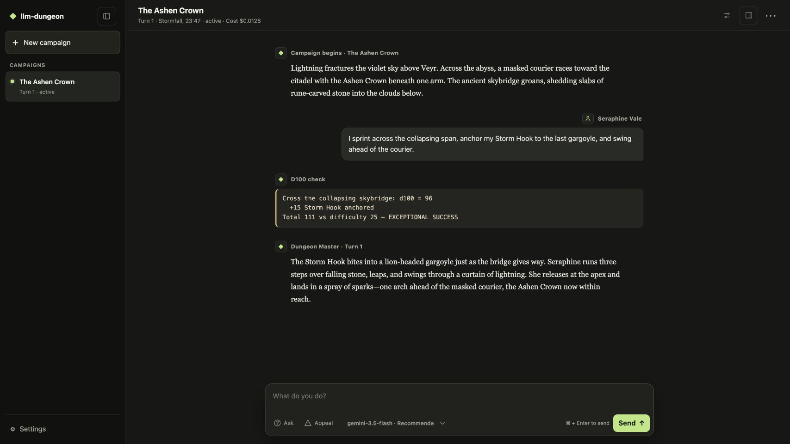

# llm-dungeon

**A local web app for persistent, narrative-first RPG campaigns with an LLM as
your dungeon master.**

Describe what your character does in plain language. The DM narrates the
consequences, calls visible d100 checks when outcomes are uncertain, and keeps
track of characters, locations, inventory, facts, and story threads between
sessions.



The app supports multiple independent campaigns and gameplay in English and
Russian.

## Quick start

You need [Node.js 22 or newer](https://nodejs.org/), npm, and an API key from at
least one supported LLM provider.

```bash
git clone https://github.com/TJurijs/llm-dungeon.git
cd llm-dungeon
npm ci
npm run web
```

Open [http://127.0.0.1:4317](http://127.0.0.1:4317). Keep the command running
while you play and press `Ctrl+C` to stop the app.

### Connect a model

On first launch, open **Settings → LLM providers** and enter a provider API key.
For the easiest start, use Google Gemini. `gemini-3.5-flash` is the recommended
default model.

A key entered in Settings remains only in server memory and is cleared when the
app stops. To keep keys between restarts, copy the environment template:

```bash
cp .env.example .env
```

On PowerShell:

```powershell
Copy-Item .env.example .env
```

Add only the keys you use:

```dotenv
GEMINI_API_KEY=
OPENROUTER_API_KEY=
XAI_API_KEY=
OPENAI_API_KEY=
DEEPSEEK_API_KEY=
```

Restart the app after changing `.env`. Never commit or share this file.

Provider requests may cost money. The app shows estimated campaign costs, but
actual billing, free tiers, and limits are controlled by each provider.

### Create a campaign

1. Select **New campaign**.
2. Enter a premise, character concept, and gameplay language.
3. Optionally choose a model or customize **World and DM style**.
4. Select **Generate preview**.
5. Accept, edit, or regenerate the preview.
6. Describe your character's action and select **Send**.

Use `Ctrl+Enter` or `Cmd+Enter` to send from the keyboard. Campaigns appear in
the sidebar and resume from the same state after restarting the app.

## Playing the game

Each campaign has its own character, story, language, world style, model, and
forward-only save. The LLM improvises the fiction while the application owns
dice, state changes, persistence, and crash recovery.

Every uncertain action uses the same visible d100 mechanic, including combat.
There are no separate hit points or initiative rules.

The inspection panel provides three player-safe views:

- **Character**, including inventory
- **Location**
- **Story threads**

The campaign menu also lets you inspect its starting setup, rename it, or export
a readable Markdown transcript.

### Ask without taking a turn

Select **Ask** or type:

```text
:ask What does my character know about this symbol?
```

Ask does not roll dice, advance time, change state, or consume a campaign turn.

### Appeal a result

Select **Appeal** or type:

```text
:appeal The inventory appears to be missing the torch I picked up.
:appeal --turn 4 The result seems inconsistent with the recorded roll.
```

An appeal reviews the durable campaign evidence and may correct current state.
It does not rewrite a committed turn, reroll, rewind the story, or resurrect a
finished character.

### Change models

Use the selector beside the composer. It shows models that have a configured
key and support the campaign's language. Changing the default in Settings
affects new campaigns only.

The curated models are:

| Provider | Models |
| --- | --- |
| Google Gemini | `gemini-3.5-flash` (recommended), `gemini-3.1-flash-lite` |
| OpenRouter | `qwen/qwen3.7-plus` |
| xAI | `grok-4.5` |
| OpenAI | `gpt-5.4` |
| DeepSeek | `deepseek-v4-flash`, `deepseek-v4-pro` |

Settings shows each model's compatibility, reliability, quality, speed, and
estimated price. You can also add a custom model ID under a provider and test
whether it supports English or Russian gameplay before using it.

### Pending requests

If a provider call is interrupted, the campaign may ask you to retry or discard
the pending request. Resolve it before sending another action or changing the
campaign's model. A persisted d100 roll is reused during recovery; it is never
silently rerolled.

### Archive or delete a campaign

Use **Campaign actions → Archive campaign** to make a campaign permanently
read-only. Its transcript, state, setup, and export remain available.

To delete one permanently:

1. Expand **Archived** in the sidebar.
2. Select the trash icon beside the campaign.
3. Type its exact title.
4. Select **Delete forever**.

Deletion cannot be undone. Export or back up important campaigns first.

## Saves and backups

Campaigns are stored under `data/campaigns/`. To create a restorable backup:

1. Stop the web app.
2. Copy the complete `data/` directory.
3. Keep its contents together; do not merge or edit individual save files.

Restore backups only while the app is stopped. Markdown exports are readable,
but they are not restorable saves.

Copy `config/` as well if you want to preserve global preferences, model
settings, and compatibility results. Store `.env` separately as a secret.

## Updating

Back up important campaigns, then run:

```bash
git pull
npm ci
npm run web
```

## Troubleshooting

- **The app says a key is missing:** add it in Settings or `.env`, then restart
  after editing `.env`.
- **A model is unavailable:** confirm its provider key is present and that the
  model supports the campaign language.
- **A turn was interrupted:** use the offered retry or discard action.
- **Port 4317 is already in use:** stop the earlier app process before starting
  another one.
- **The browser cannot connect:** keep `npm run web` running and open
  `http://127.0.0.1:4317`.

## Privacy and limitations

- The app and campaign files run locally, but prompts are sent to the provider
  you configure.
- The local server has no authentication or TLS and binds to `127.0.0.1` by
  default. Do not expose it to the internet or an untrusted network.
- Saves move forward only. Dead, ended, and archived campaigns cannot resume.
- Model behavior, pricing, limits, and uptime depend on third-party providers.
- English and Russian are the currently supported interface and gameplay
  languages.
- There is no supported public or multi-user API.

## License

Licensed under the [Apache License 2.0](LICENSE).
