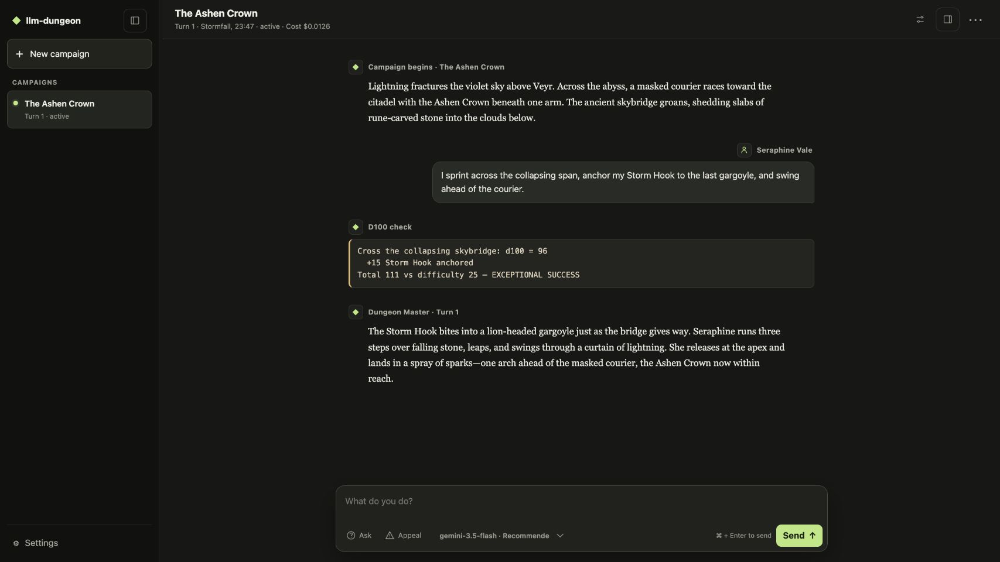

# llm-dungeon

**A local web app for persistent, narrative-first RPG campaigns with an LLM as
your dungeon master.**

Describe what your character does in plain language. The DM narrates the
consequences, calls visible d100 checks when outcomes are uncertain, and keeps
track of characters, locations, inventory, facts, and story threads between
sessions.



The app supports multiple independent campaigns and gameplay in English and
Russian.

**New here?** You don't have to invent anything to start. Pick a **pre-shipped
campaign seed** — a ready-made world, scenario, and character — and you're
playing in about a minute. A hand-crafted **Dark Sun — Sealed Oasis** seed ships
with the app; see [Create a campaign](#create-a-campaign).

## Quick start

Before you start, make sure you have:

- **[Node.js 22 or newer](https://nodejs.org/)** — npm is bundled with it, so
  this is the only download needed for that part.
- **[Git](https://git-scm.com/downloads)** — to download this project.
- **An API key from an LLM provider.** For the easiest start, get a free key
  from **[Google AI Studio](https://aistudio.google.com/apikey)** (sign in,
  select "Create API key", then copy it — you'll paste it into the app in a
  moment). Any other [supported provider](#change-models) works too.

```bash
git clone https://github.com/TJurijs/llm-dungeon.git
cd llm-dungeon
npm ci
npm run web
```

Open [http://127.0.0.1:4317](http://127.0.0.1:4317). Keep the command running
while you play and press `Ctrl+C` to stop the app.

### Connect a model

On first launch, open **Settings → LLM providers** and enter a provider API key.
For the easiest start, use Google Gemini. `gemini-3.6-flash` is the recommended
default model.

A key entered in Settings remains only in server memory and is cleared when the
app stops. To keep keys between restarts, copy the environment template:

```bash
cp .env.example .env
```

On PowerShell:

```powershell
Copy-Item .env.example .env
```

Add only the keys you use:

```dotenv
GEMINI_API_KEY=
OPENROUTER_API_KEY=
XAI_API_KEY=
OPENAI_API_KEY=
ANTHROPIC_API_KEY=
DEEPSEEK_API_KEY=
```

After changing `.env`, use the reload icon in **Settings → LLM providers** or
restart the app. Never commit or share this file.

Provider requests may cost money. The app records every physical request,
including retries, repairs, failed calls, questions, and post-game stories. Its
estimates and local limits use known standard token prices; actual billing,
free tiers, price changes, and provider-side limits remain controlled by the
provider.

### Create a campaign

**The fastest way to play** — start from a pre-shipped seed:

1. Select **New campaign**.
2. Under **Campaign seed**, pick a ready-made scenario. The shipped **Dark Sun —
   Sealed Oasis** drops you into a walled desert oasis whose only well is turning
   to ash and whose panicked rulers have just sealed the gates with you inside.
   Picking it fills in the world, opening, and character for you.
3. Select **Generate preview**, then **Accept and begin**.
4. Describe your character's action and select **Send**.

That's it — you're playing. Seeds are only a starting point: every field stays
editable, and a seed plays in whatever gameplay language you choose.

**Prefer your own story?** Skip the seed and write your own instead:

1. Select **New campaign**.
2. Enter a premise and character concept — or leave them blank for a classic
   opening — and choose a gameplay language.
3. Optionally choose a model or customize **World and DM style**.
4. Select **Generate preview**, then accept, edit, or regenerate it.
5. Describe your character's action and select **Send**.

Use `Ctrl+Enter` or `Cmd+Enter` to send from the keyboard. Campaigns appear in
the sidebar and resume from the same state after restarting the app.

While a preview or turn is generating, its button becomes **Stop**. Stop ends
the browser's wait, not the already-sent provider work. A stopped setup preview
finishes silently and is discarded. A stopped campaign turn may still commit;
its result appears automatically when it settles. That campaign remains
serialized until then, while other campaigns and new setup work remain
available.

Dead, ended, and archived campaigns show **Short story** in the campaign header.
When a turn ends a campaign, the app makes one best-effort story call after the
terminal turn is safely committed. Opening **Short story** reads the artifact
saved for that exact campaign snapshot. If none exists, **Generate story** makes
one explicit provider call with the campaign's saved model and may incur provider
costs; a failed attempt can be retried. The resulting 400–600-word retrospective
is included in both Markdown and readable HTML campaign exports. This post-game
artifact does not add a turn, alter gameplay state, or write an error into the
transcript. Its **Stop** button only stops the browser's wait while the server
finishes and saves the result safely in the background.

## Playing the game

Each campaign has its own character, story, language, world style, model, and
forward-only save. The LLM improvises the fiction while the application owns
dice, state changes, persistence, and crash recovery.

Every uncertain action uses the same visible d100 mechanic, including combat.
There are no separate hit points or initiative rules.

Outside immediate pressure, routine consequence-free travel and searching may
advance to the next meaningful choice, obstacle, or discovery instead of
stopping at every doorway or empty step. Important discovered places become
durable locations; incidental transit details stay in recent narration rather
than accumulating as permanent facts.

The inspection panel provides three player-safe views:

- **Character**, including inventory
- **Location**
- **Story threads**

The campaign menu also lets you inspect its starting setup, rename it, or export
a readable Markdown transcript.

### Ask without taking a turn

Select **Ask** or type:

```text
:ask What does my character know about this symbol?
```

Ask does not roll dice, advance time, change state, or consume a campaign turn.

### Appeal a result

Select **Appeal** or type:

```text
:appeal The inventory appears to be missing the torch I picked up.
:appeal --turn 4 The result seems inconsistent with the recorded roll.
```

An appeal reviews the durable campaign evidence and may correct current state.
It does not rewrite a committed turn, reroll, rewind the story, or resurrect a
finished character.

### Change language

The Language setting controls the interface and is the initial language for a
new campaign. You can choose a different story language while creating that
campaign without changing the interface.

### Change models

Use the selector beside the composer. It shows models that have a configured
key and support the campaign's language. Changing the default in Settings
affects new campaigns only.

The curated models are:

| Provider      | Models                                                    |
| ------------- | --------------------------------------------------------- |
| Google Gemini | `gemini-3.6-flash` (recommended), `gemini-3.5-flash-lite` |
| OpenRouter    | `qwen/qwen3.7-plus`                                       |
| xAI           | `grok-4.5`                                                |
| OpenAI        | `gpt-5.4`                                                 |
| Anthropic     | `claude-sonnet-5`                                         |
| DeepSeek      | `deepseek-v4-flash`, `deepseek-v4-pro`                    |

Settings shows each model's compatibility, reliability, quality, speed, and
estimated price. You can also add a custom model ID under a provider and test
whether it supports English or Russian gameplay before using it.

### Pending requests

If a provider call is interrupted, the campaign may ask you to retry or discard
the pending request. Resolve it before sending another action or changing the
campaign's model. A persisted d100 roll is reused during recovery; it is never
silently rerolled.

### Control campaign spending

Open **Campaign actions → Spending limits** to see settled and currently
reserved spend, the recent per-turn projection, and the projected cost of 100
similar turns. You may set either or both of these optional USD limits:

- **Campaign limit** prevents a new provider request when its conservative
  reservation would cross the campaign's remaining allowance.
- **Per-turn limit** bounds all decision, retry, repair, and locked-resolution
  calls belonging to one durable gameplay turn.

Before gameplay starts, the app reserves the complete per-turn allowance
against the campaign limit. This keeps a checked turn from running out of
campaign budget after its d100 result is locked but before resolution; unused
allowance is released when the turn settles. A retry retains the same logical
turn identity and prior spend. Questions and completed stories count against
the campaign limit but not the per-turn limit.

Reaching a limit pauses provider work; it never kills the character or ends the
story. Raise or clear the relevant limit, then retry the preserved pending turn.
For a custom model without known token pricing, the app cannot guarantee a USD
cap and therefore pauses before sending while a USD limit is enabled.

Accepted setup-generation attempts become the new campaign's physical spending
history; abandoned preview ledgers are removed. Published autoplay archives
likewise retain their settled attempts and original limits. Archived fiction
stays read-only, but its operational limits remain editable so a missing short
story can be retried without reopening gameplay.

### Long-running campaign memory

The canonical Markdown save and transcript remain complete and may grow to any
turn count supported by local storage. Model calls receive a deterministic,
bounded working projection instead: current authoritative state, compact entity
records, active threads, major events, eight recent summaries, and only the
latest full narration. Older or unrelated records stay on disk and an exact
entity ID or full name in the submitted action deterministically reactivates a
cold record—there is no embedding search or extra LLM compaction call.

Durable facts are stored on the person, place, item, or other entity they
describe. **Known details** is derived from player-visible facts across those
subjects, so it does not become a duplicate movement journal. Routine
consequence-free traversal remains recent prose; lasting discoveries,
consequences, and important reusable locations remain durable. Every provider
attempt also has a phase-aware preflight with a maximum 100,000-unit input
allowance and a reserved output/schema margin. New campaign seeds that cannot
fit their permanent context slots are rejected before a paid setup request.

### Archive or delete a campaign

Use **Campaign actions → Archive campaign** to make a campaign permanently
read-only. Its transcript, state, setup, and export remain available. Spending
limits remain adjustable only to authorize independent short-story retries;
they cannot resume or mutate the archived campaign.

To delete a player-created campaign permanently:

1. Expand **Archived** in the sidebar.
2. Select the trash icon beside the campaign.
3. Type its exact title.
4. Select **Delete forever**.

Archived autoplay campaigns published by the developer playtest harness are
disposable snapshots. Their trash icon deletes them immediately without asking
for the title.

Deletion cannot be undone. Export or back up important campaigns first.

## Saves and backups

Campaigns are stored under `data/campaigns/`. Create a lock-coherent, restorable
snapshot while the app is stopped or running with:

```bash
npm run dev -- backup ./backups/dungeon-2026-07-28
```

The target must not already exist. The command locks the catalog and every
campaign in deterministic order, validates the staged snapshot, records file
checksums and schema versions, and publishes it atomically. It includes durable
campaign data and known non-secret configuration, but excludes `.env`, active
lock files, temporary writes, and disposable setup drafts.

To inspect the catalog, campaigns, and pending recovery artifacts without
changing or recovering anything, run:

```bash
npm run dev -- doctor
```

`doctor` reports recoverable pending work in resumable campaigns as warnings,
flags legacy records that exceed current bounded-context admission guidance,
and validates spending reservations and ledgers. Malformed or inconsistent
durable state is an error. Any pending work in a read-only archived campaign is
an error. It never reads or prints `.env` contents.

For a manual backup instead:

1. Stop the web app.
2. Copy the complete `data/` directory.
3. Keep its contents together; do not merge or edit individual save files.

Restore backups only while the app is stopped. Markdown exports are readable,
but they are not restorable saves.

Copy `config/` as well if you want to preserve global preferences, model
settings, and compatibility results. Store `.env` separately as a secret.

## Updating

Back up important campaigns, then run:

```bash
git pull
npm ci
npm run web
```

## Troubleshooting

- **The app says a key is missing:** add it in Settings or `.env`, then use the
  reload icon in the LLM Providers header after editing `.env`.
- **A model is unavailable:** confirm its provider key is present and that the
  model supports the campaign language.
- **A turn was interrupted:** use the offered retry or discard action.
- **Port 4317 is already in use:** stop the earlier app process before starting
  another one.
- **The browser cannot connect:** keep `npm run web` running and open
  `http://127.0.0.1:4317`.

## Privacy and limitations

- The app and campaign files run locally, but prompts are sent to the provider
  you configure.
- The local server has no authentication or TLS and binds to `127.0.0.1` by
  default. Do not expose it to the internet or an untrusted network.
- Saves move forward only. Dead, ended, and archived campaigns cannot resume.
- Model behavior, pricing, limits, and uptime depend on third-party providers.
- English and Russian are the currently supported interface and gameplay
  languages.
- There is no supported public or multi-user API.

## Developer playtests

The developer-only playtest harness can run scripted or model-driven packages.
Every model-driven package uses `gemini:gemini-3.6-flash@direct` as its fixed
simulated-player model when `--player` is omitted; `--player-profile` still
selects one of the package's allowed behavior profiles. Override the model
explicitly when needed:

```bash
npm run playtest -- playtest run campaign-autoplay-v1 \
  --candidate openai:gpt-5.4@direct \
  --player gemini:gemini-3.6-flash@direct \
  --player-profile curious-explorer \
  --max-cost 2
```

Candidate and player targets require their provider keys and matching frozen
execution profiles. Autoplay does not invoke an AI judge: each job publishes an
idempotent, tagged, archived campaign copy in the browser for normal transcript
inspection and download. Ask Codex to review that log when desired. Packages
that explicitly define a judge still require a judge target. The same model may
serve as both autoplay candidate and simulated player: they remain separate
provider calls with separate prompts, context, telemetry, and failure lanes.
These commands make paid calls and always require an explicit aggregate cost ceiling.

When a production playtest diagnostic proves that the exact frozen profile
exhausted a phase's full output budget, calibration can retain that evidence
and test the next bounded budget step without depending on the same stochastic
truncation happening again:

```bash
npm run playtest -- playtest calibrate \
  --target gemini:gemini-3.6-flash@direct \
  --scenario-seed far-meridian-dead-signal \
  --language en \
  --truncation-evidence playtests/runs/RUN_ID/jobs/job-001/diagnostics/CALL_ID.json \
  --max-cost 2
```

Repeat `--truncation-evidence` when exact-baseline diagnostics prove separate
phase limits. The command rejects a different provider, model, route, profile
fingerprint, reduced request ceiling, or non-truncation failure; it freezes a
raised profile only when the evidence-implied minimum passes the complete
calibration suite. A changed profile fingerprint makes older certification
evidence stale until certification is rerun explicitly.

## License

Licensed under the [Apache License 2.0](LICENSE).
